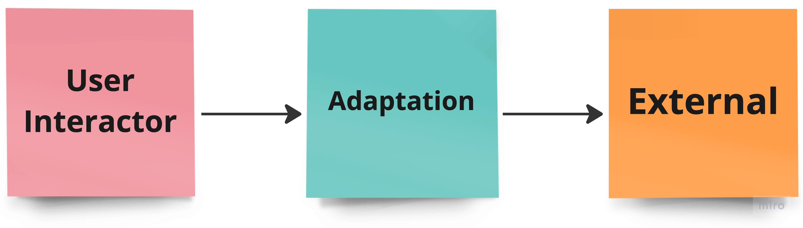
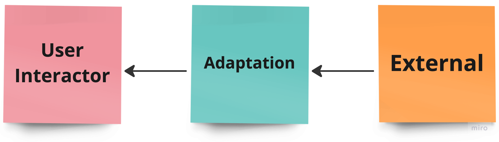

# Arquitetura MiniCore

**Objetivo**: Propor uma arquitetura simplificada e de fácil entendimento, tendo como foco o FrontEnd. A estrutura proposta é baseada em três camadas distintas, sendo elas: User Interactor, Adaptation e External.

### Camadas

**User Interactor**: Deve ser responsável pelas entradas, saídas e interações da aplicação.

**Adaptation**: Deve ser responsável por realizar a tradução e comunicação entre as camadas de User Interactor e External.

**External**: Deve ser responsável por lidar com as informações externas à sua aplicação.
 
 

 
 

### Limites

Dentro dos limites arquiteturais estabelecidos, destaca-se que a camada User Interactor não deve possuir acesso direto à camada External. Para contornar essa restrição, a camada Adaptation atua como intermediária, realizando a comunicação entre as camadas User Interactor e External.

Visando aprimorar o desenvolvimento com eficiência e flexibilidade, a arquitetura assegura um baixo acoplamento através da clara separação de responsabilidades em cada camada.
