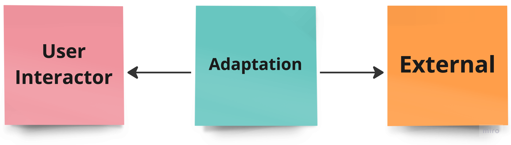

# MiniCore

Arquitetura MiniCore

O principal objetivo dessa arquitetura é seu foco no FrontEnd. A estrutura é composta por três camadas distintas: User Interactor, Adaptation e External, proporcionando assim, um baixo acoplamento. Esse design visa aprimorar a experiência de desenvolvimento, promovendo eficiência e flexibilidade através da clara separação das responsabilidades em cada camada.

A camada User Interactor no miniCore assume a responsabilidade crucial de gerenciar a interação com o usuário. A camada Adaptation desempenha um papel fundamental ao adaptar informações provenientes da camada externa para a camada User Interactor. Já a camada External assume a responsabilidade de armazenar dados voláteis que estão sujeitos a constantes alterações.

Dentro dos limites arquiteturais estabelecidos, destaca-se que a camada User Interactor não possui acesso direto à camada External. Para contornar essa restrição, a camada Adaptation atua como intermediária, facilitando a comunicação entre a camada User Interactor e a camada External.



A camada User Interaction é o espaço designado para a gestão de estados e ações do usuário. Nela, definiremos e controlaremos as interações do usuário durante o uso do sistema.

Por outro lado, a camada Adaptation desempenhará um papel crucial, conectando-se a interfaces com APIs e bancos de dados. Essa camada é responsável por facilitar a comunicação e a adaptação eficiente de dados entre o sistema e fontes externas, garantindo uma integração suave e eficaz e a nossa camada External como falado anteriormente assume a responsabilidade de armazenar dados voláteis que estão sujeitos a constantes alterações.

Outro ponto importante nessa arquitetura será o estado global, com isso ganhamos: <br><br>
Acessibilidade Universal: O estado global permite que os dados sejam acessados de qualquer lugar da aplicação. Isso pode ser útil quando você precisa compartilhar informações entre diferentes partes da interface do usuário ou entre várias páginas.

Redução da Complexidade: Em vez de passar dados através de vários componentes como parâmetros, o uso de um estado global pode simplificar o código, tornando-o mais legível e fácil de entender.

Facilidade de Manutenção: Ao centralizar o estado em um local global, torna-se mais fácil manter e modificar o estado da aplicação. Isso pode facilitar a resolução de bugs e a implementação de novos recursos.

Melhor Desempenho: Dependendo da implementação, um estado global bem gerenciado pode levar a um melhor desempenho, especialmente em comparação com abordagens onde os dados precisam ser passados através de muitos componentes.

## Estruturando nossa Arquitetura

### External
fica responsável por declarar as entradas, saídas e interações da aplicação.
Usando o Flutter como exemplo, usariamos os Widgets, Pages e subpages.

### User Interaction
Onde encontramos nossos estados, reatividades e ações(onde usaremos funções para modificar nossos estados ou reatividades).

### Adaptation
Onde encontramos nossas adaptações, como serialização e nossa comunicação com apis e banco de dados locais. A camada de adaptação é muito importante para a saúde do projeto, caso alguém pare de dar suporte algum serviço que utilizamos em nossa aplicação, dessa forma fica muito fácil de trocar utilizando a injeção de dependência adequada, e assim não afetaria nosso código de interação independente das mudanças internas.


## Proposta de estrutura de pasta e pattern para utilização da arquiterura

As estrutura de pastas deve ficar como no exemplo abaixo.

```
.
└── app/
    ├── public/
    │   └── pages
    ├── core/
    │   ├── assets
    │   ├── themes
    │   └── widgets
    ├── data/
    │   ├── adapters
    │   ├── repositories
    │   └── services
    └── interactor/
        ├── atoms
        ├── actions
        ├── dtos
        ├── models 
        ├── repositories
        └── services
```

## Public
Na camada Public, encontram-se as páginas e subpáginas do aplicativo, sendo responsável pela apresentação visual e interativa.

## Interactor
Na camada Interactor, assume-se a responsabilidade pela execução. Nela estão presentes patters como como ASP - Atomic State Pattern, DTO(Data Transfer Object), Models, Prototype e para o baixo acomplamentos colocamos os contratos do repositório e dos serviços.

- #### Atoms: 
    Atom refere-se a um estado que possui reatividade própria, contribuindo para a dinâmica do objeto.

- #### Actions: 
    Actions têm o propósito de ser funções para modificar nossos estados ou reatividades.

- #### DTO: 
    O Data Transfer Object é um padrão de design usado para transferir dados entre camadas, assegurando uma comunicação eficiente.

- #### Models: 
    Models representa a estrutura de dados e as regras de negócios da aplicação.

- #### Prototype:
    É um padrão de design creacional que visa criar novos objetos duplicando, ou clonando, objetos existentes

- #### Contratos: 
    Nessa seção incluímos interfaces do repositório e serviços, delineando claramente os compromissos necessários. Ao trabalharmos com contratos temos a possibilidade de trocar uma base de dados por exemplo sem comprometer a nossa regra de negocio alterando apenas a nossa implementação do repositório ou serviço.

## Data
A camada Data assume a responsabilidade de interagir tanto com fontes externas (APIs) quanto internas (Banco de dados locais).

- #### Adapter:
    Os adaptadores são componentes auxiliares que devem realizar a conversão de um dado do mundo externo para um formato que é compreendido pelo domínio da aplicação. É nesse componente que inserimos o código responsável por realizar a serialização e desserialização dos dados provenientes de uma API ou banco de dados. Normalmente, um adaptador deve ser criado para cada entidade da aplicação, mas é permitido a existência múltiplos adaptadores para uma mesma entidade, visto que múltiplas fontes de dados podem ser utilizadas.

- #### Repository: 
    O padrão Repository proporciona uma abstração entre a lógica de negócios e o acesso aos dados, simplificando a gestão e manipulação desses dados.

- #### Service: 
    O padrão Service, amplamente utilizado em arquiteturas de software, encapsula a lógica de negócios para promover modularidade, reutilização e facilidade de manutenção.

## Core
Na camada Core, encontram-se dados globais e reutilizáveis fornecidos para todas as camadas da aplicação, incluindo como exemplo: temas, widgets, design system e dados compartilhados. Essa camada é fundamental para manter a coesão e consistência em toda a aplicação.

## Benefícios da Utilização da Arquitetura MiniCore:

- #### Facilidade de Entendimento: 
    Proporciona uma estrutura clara e intuitiva, facilitando a compreensão do código para desenvolvedores.

- #### Manutenibilidade:
    A divisão em camadas e a clareza das responsabilidades tornam o código mais fácil de manter e atualizar.

- #### Escalabilidade de Código:
    A arquitetura é projetada para lidar com o crescimento da aplicação, garantindo que ela possa escalar de maneira eficaz.

- #### Acesso Fácil a Variáveis e Métodos Globais:
    Facilita o acesso a variáveis e métodos globais, promovendo uma comunicação eficiente entre as diferentes partes do sistema.

- #### Facilita Testes (Sem a Necessidade de Mockar os Atoms):
    Simplifica a realização de testes, eliminando a necessidade de simular ou simbolizar (mockar) os Atoms, tornando o processo de teste mais eficiente e menos complexo.

<br>

Ao adotar a arquitetura MiniCore, os desenvolvedores ganham um desenvolvimento de sistemas mais robustos, eficientes e de fácil manutenção, promovendo uma experiência de desenvolvimento mais positiva e sustentável.

## Exemplos

Veja alguns [exemplos](https://github.com/FelCarv01/mini-core-examples).


